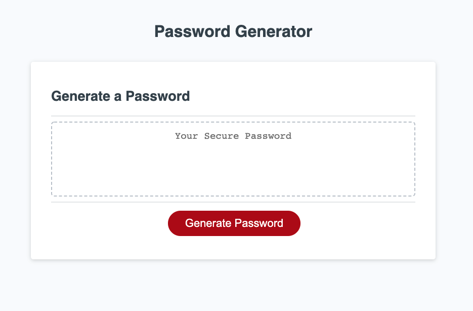

# Random Password Generator, NEW-PW-PLZ
## Description
Randomly generate a password based on certain criteria

On the project learning: 
* Javascript development of code
* Continual testing for accurate deployment

Challenges:
* Logic, looping and storing values

## Built With
* Javascript
 

## Website
Visit the [project](https://violanerd.github.io/new-pw-plz/)

## Contribution

Developed by Madalyne Cross